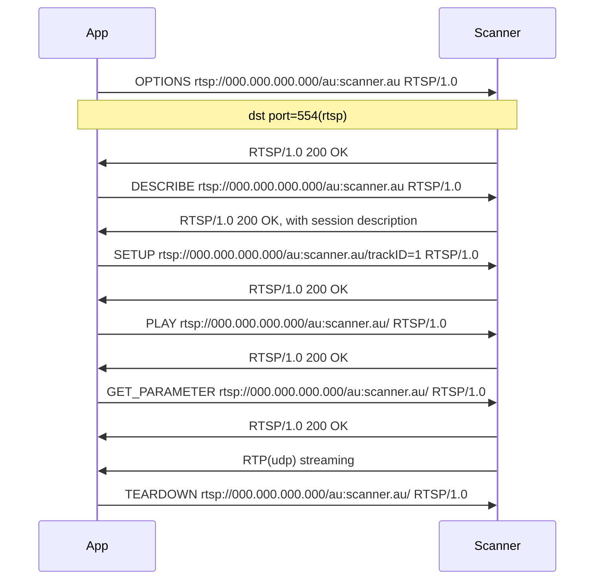

Summary 
RTSP version: RTSP/1.0 
Streaming Media: Audio only (no video) 
Media Format: G.711 u-law  
Media Filename: scanner.au  
Media Server Name: Scanner Audio Server 0.0.1  
Cache-Control: no-cache  
Transport: RTP/AVP unicast  
Supported RTSP Method:  
&emsp;PLAY  
&emsp;TEARDOWN  
&emsp;GET_PARAMETER  
&emsp;SETUP  
&emsp;DESCRIBE  
&emsp;OPTIONS   

Scanner received on TCP and responds via UDP

RTSP METHOD
(*A)Global IP Address of Scanner
(*B)Depends on app's device
(*C)Scanner Assigned number
(*D)app Assigned number(port number)

<table>
  <thead>
    <tr>
      <th>Direction</th>
      <th>Method</th>
      <th>Contents</th>
    </tr>
  </thead>
  <tbody>
    <tr>
      <td>A--&gt;S</td>
      <td>OPTIONS</td>
      <td>To Get Supported RTSP Method OPTIONS rtsp://xxx.xxx.xxx.xxx (*A)/au:scanner.au RTSP/1.0 CSeq: 2 User-Agent: xxxxxxxxxxx(*B)</td>
    </tr>
    <tr>
      <td>S--&gt;A</td>
      <td>Reply</td>
      <td>DESCRIBE, SETUP, TEARDOWN, PLAY, OPTIONS, GET_PARAMETER methods supported. RTSP/1.0 200 OK Supported: play.basic, con.persistent Cseq: 2 Server: Scanner Audio Server 0.0.1 Public: DESCRIBE, SETUP, TEARDOWN, PLAY, OPTIONS, GET_PARAMETER Cache-Control: no-cache</td>
    </tr>
    <tr>
      <td>A--&gt;S</td>
      <td>DESCRIBE</td>
      <td>To Get Session Description(Media Format…) DESCRIBE rtsp://xxx.xxx.xxx.xxx (*A)/au:scanner.au RTSP/1.0 CSeq: 3 User-Agent: xxxxxxxxxxx(*B) Accept: application/sdp</td>
    </tr>
    <tr>
      <td rowspan="2">S--&gt;A</td>
      <td>REPLY</td>
      <td>/w sdp RTSP/1.0 200 OK Content-Base: rtsp://xxx.xxx.xxx.xxx (*A)/au:scanner.au/ Date: Tue, 3 Dec 2013 08:10:30 UTC Content-Length: 575 Session: 593922212;timeout=60 Expires: Tue, 3 Dec 2013 08:10:30 UTC Cseq: 3 Content-Type: application/sdp Server: Scanner Audio Server 0.0.1 Cache-Control: no-cache</td>
    </tr>
    <tr>
      <td>sdp</td>
      <td>v=0 o=- 0000000000(*c) IN IP4 127.0.0.1 s=scanner.au c=IN IP4 0.0.0.0 t=0 0 a=sdplang:en a=control: m=audio 0 RTP/AVP 0 a=control:trackID=1</td>
    </tr>
    <tr>
        <td>A--&gt;S</td>
        <td>SETUP</td>
        <td>To decide UDP portnumber SETUP rtsp://xxx.xxx.xxx.xxx (*A)/au:scanner.au/trackID=1 RTSP/1.0 CSeq: 4 User-Agent: xxxxxxxxxxx(*B) Transport: RTP/AVP;unicast;client_port=0000(*D)</td>
    </tr>
    <tr>
        <td>S--&gt;A</td>
        <td>Reply</td>
        <td>UDP port number for RTP streaming RTSP/1.0 200 OK Date: Tue, 3 Dec 2013 08:10:30 UTC Transport: RTP/AVP;unicast;client_port=0000(*D);source=xxx.xxx.xxx.xxx (*A);server_port=0000(*C);ssrc=00000000(*C) Session: 0000000000(*c);timeout=60 Expires: Tue, 3 Dec 2013 08:10:30 UTC Cseq: 4 Server:Scanner Audio Server 0.0.1 Cache-Control: no-cache</td>
    </tr>
    <tr>
        <td>A--&gt;S</td>
        <td>PLAY</td>
        <td>To Open RTP(UDP) PLAY rtsp://xxx.xxx.xxx.xxx (*A)/au:scanner.au/ RTSP/1.0 CSeq: 6 User-Agent: xxxxxxxxxxx(*B) Session: 0000000000(*C) Range: npt=0.000-</td>
</tr>
<tr> 
    <td>S--&gt;A</td>
    <td>Reply</td>
    <td>RTP(UDP) streaming RTSP/1.0 200 OK Range: npt=0.0-596.48 Session: 0000000000(*c);timeout=60 Cseq: 6 RTP-Info: url=rtsp://xxx.xxx.xxx.xxx (*A)/au:scanner.au/trackID=1;seq=1;rtptime=0 Server:Scanner Audio Server 0.0.1 Cache-Control: no-cache</td>
</tr>
<tr>
    <td>A--&gt;S</td>
    <td>GET_PARAMETER</td>
    <td>To Keep RTSP(RTP) alive GET_PARAMETER rtsp://xxx.xxx.xxx.xxx (*A)/au:scanner.au/ RTSP/1.0 CSeq: 5 User-Agent: xxxxxxxxxxx(*B) Session: 0000000000(*C)</td>
</tr>
<tr>
    <td>S--&gt;A</td>
    <td>Reply</td>
    <td>RTSP/1.0 200 OK Session: 0000000000(*c);timeout=60 Cseq: 5 Server:Scanner Audio Server 0.0.1 Cache-Control: no-cache</td>
</tr>
<tr>
    <td>A--&gt;S</td>
    <td>TEARDOWN</td>
    <td>To Stop RTSP(RTP) TEARDOWN rtsp://xxx.xxx.xxx.xxx (*A)/au:scanner.au/ RTSP/1.0 CSeq: 8 User-Agent: xxxxxxxxxxx(*B) Session: 0000000000(*C)</td>
</tr>
</tbody>
</table>

A: App
S: Scanner
