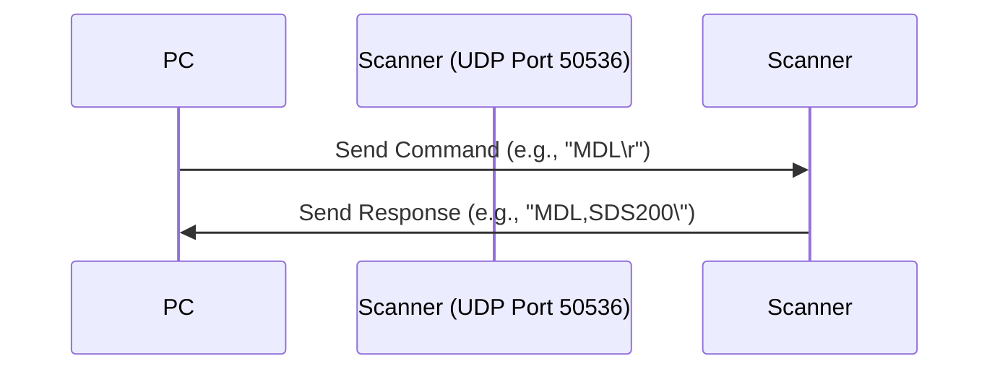
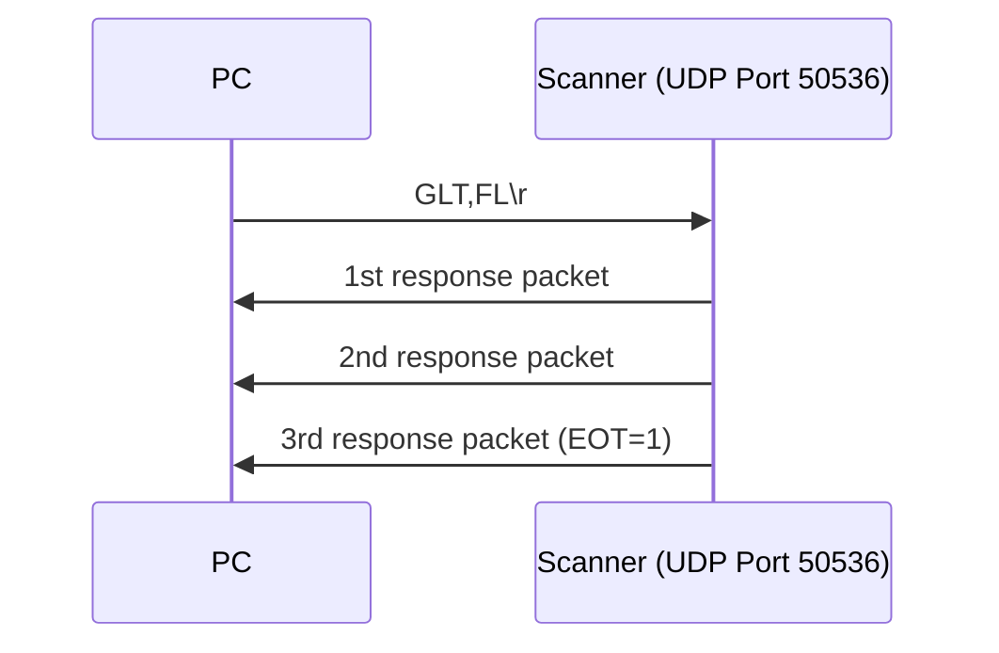

# SDS200 Remote Command Specification Reference (v1.02)
This document contains the command protocols, key codes, service types, and audio sub-tone mappings for the Uniden SDS200 scanner.

### Device Command Reference

| Command No. | Command | Function                           | Description                                                                                       |
|-------------|---------|------------------------------------|---------------------------------------------------------------------------------------------------|
| 1           | MDL     | Get Model Info                     | Returns SDS200.                                                                                   |
| 2           | VER     | Get Firmware Version               | Returns version `x.xx.xx`.                                                                        |
| 3           | KEY     | Simulate Button Press              | Format: `KEY,[CODE],[MODE]`.                                                                      |
| 4           | QSH     | Quick Search Hold Mode             | Go to quick search hold mode.                                                                     |
| 5           | STS     | Get Current Status                 | Returns the current status.                                                                       |
| 6           | JNT     | Jump Number Tag                    | Format: `JNT,[FL_TAG],[SYS_TAG],[CHAN_TAG]`.                                                      |
| 7           | NXT     | Next Channel/Frequency             | Moves to the next channel or frequency.                                                           |
| 8           | PRV     | Previous Channel/Frequency         | Moves to the previous channel or frequency.                                                       |
| 9           | FQK     | Favorites List Quick Keys Status   | Get/Set status: `0` = None, `1` = Disabled, `2` = Enabled.                                        |
| 10          | SQK     | System Quick Keys Status           | Get/Set status: `0` = None, `1` = Disabled, `2` = Enabled.                                        |
| 11          | DQK     | Department Quick Keys Status       | Get/Set status: `0` = None, `1` = Disabled, `2` = Enabled.                                        |
| 12          | PSI     | Push Scanner Information           | Returns the full scanner state in XML.                                                            |
| 13          | GSI     | Get Scanner Information            | Returns the full scanner state in XML.                                                            |
| 14          | GLT     | Get List                          | Retrieves internal lists (Favorites, Systems, Departments) in XML format.                         |
| 15          | HLD     | Hold                               | Holds the current system, department, or channel.                                                 |
| 16          | AVD     | Set Avoid Status                   | `1` = Permanent, `2` = Temporary, `3` = Stop Avoiding.                                            |
| 17          | SVC     | Service Type Settings              | Get/Set service types (`0` = Off, `1` = On).                                                      |
| 18          | JPM     | Jump Mode                          | Switches modes (e.g., `WF_MODE` for Waterfall, `WX_MODE` for Weather).                            |
| 19          | DTM     | Date & Time                        | Gets/Sets Real Time Clock status. Returns `0` (RTC NG) or `1` (RTC OK).                           |
| 20          | LCR     | Location and Range                 | Get/Set location and range.                                                                       |
| 21          | AST     | Analyze Start                      | Starts functions like LCN Finder or Current Activity.                                              |
| 22          | APR     | Analyze Pause/Resume               | Pauses or resumes analysis.                                                                       |
| 23          | URC     | User Record Control                | Starts (`1`) or stops (`0`) recording.                                                            |
| 24          | MNU     | Menu Mode                          | Menu Mode command.                                                                                |
| 25          | MSI     | Menu Status Info                   | Gets menu status information.                                                                     |
| 26          | MSV     | Menu Set Value                     | Sets a menu value.                                                                                |
| 27          | MSB     | Menu Structure Back                | Goes back in the menu structure.                                                                  |
| 28          | GST     | Get Waterfall Status               | Returns center frequency, span, and FFT size.                                                     |
| 29          | PWF     | Push Waterfall FFT Information     | Pushes waterfall FFT information.                                                                 |
| 30          | GWF     | Get Waterfall FFT Information      | Gets waterfall FFT information.                                                                   |

### Key Code Mapping (KEY Command)

Use these codes with the KEY command (e.g., `KEY,M,P` to press Menu).

| Key Code   | SDS200 Button | Function                 |
|------------|---------------|--------------------------|
| `M`        | Menu          | Enter Menu               |
| `F`        | Func          | Function                 |
| `L`        | Avoid         | Avoid Channel/System     |
| `E`        | E (Yes)       | Enter / Select           |
| `.`        | No            | Decimal / No             |
| `0-9`      | 0-9           | Number Pad               |
| `>`        | Rotary Right  | Scroll Right             |
| `<`        | Rotary Left   | Scroll Left              |
| `(Rotary)` | Rotary Push   | Select / Click           |
| `V`        | Volume        | Volume / Backlight       |
| `Y`        | Replay        | Replay Audio             |
| `A`        | Soft Key 1    | Context Sensitive        |
| `B`        | Soft Key 2    | Context Sensitive        |
| `C`        | Soft Key 3    | Context Sensitive        |
| `Z`        | Zip           | Zip Code Function        |
| `R`        | Rang          | Range Function           |

### Service Type IDs (SVC Command)

Used to toggle specific service types (`0` = Off, `1` = On).

| ID    | Service Type      | ID    | Service Type      |
|-------|------------------|-------|------------------|
| PST1  | Multi-Dispatch   | PST20 | Railroad         |
| PST2  | Law Dispatch     | PST21 | Other            |
| PST3  | Fire Dispatch    | PST22 | Multi-Talk       |
| PST4  | EMS Dispatch     | PST23 | Law Talk         |
| PST6  | Multi-Tac        | PST24 | Fire-Talk        |
| PST7  | Law Tac          | PST25 | EMS-Talk         |
| PST8  | Fire-Tac         | PST26 | Transportation   |
| PST9  | EMS-Tac          | PST29 | Emergency Ops    |
| PST11 | Interop          | PST30 | Military         |
| PST12 | Hospital         | PST31 | Media            |
| PST13 | Ham              | PST32 | Schools          |
| PST14 | Public Works     | PST33 | Security         |
| PST15 | Aircraft         | PST34 | Utilities        |
| PST16 | Federal          | PST37 | Corrections      |
| PST17 | Business         |       |                  |

### Sub-Audio Codes (CTCSS / DCS / NAC)

These hex values are used in various commands to specify audio tones.

#### Analog (CTCSS)

| Hex Value | Frequency (Hz) | Hex Value | Frequency (Hz) |
|-----------|---------------|-----------|---------------|
| 0x0000    | None/Search   | 0x0023    | 151.4         |
| 0x0001    | 67.0          | 0x0024    | 156.7         |
| 0x0002    | 69.3          | 0x0025    | 159.8         |
| 0x0003    | 71.9          | 0x0026    | 162.2         |
| 0x0004    | 74.4          | 0x0027    | 165.5         |
| 0x0005    | 77.0          | 0x0028    | 167.9         |
| 0x0006    | 79.7          | 0x0029    | 171.3         |
| 0x0007    | 82.5          | 0x002A    | 173.8         |
| 0x0008    | 85.4          | 0x002B    | 177.3         |
| 0x0009    | 88.5          | 0x002C    | 179.9         |
| 0x000A    | 91.5          | 0x002D    | 183.5         |
| 0x000B    | 94.8          | 0x002E    | 186.2         |
| 0x000C    | 97.4          | 0x002F    | 189.9         |
| 0x000D    | 100.0         | 0x0030    | 192.8         |
| 0x000E    | 103.5         | 0x0031    | 196.6         |
| 0x000F    | 107.2         | 0x0032    | 199.5         |
| 0x0010    | 110.9         | 0x0033    | 203.5         |
| 0x0011    | 114.8         | 0x0034    | 206.5         |
| 0x0012    | 118.8         | 0x0035    | 210.7         |
| 0x0013    | 123.0         | 0x0036    | 218.1         |
| 0x0014    | 127.3         | 0x0037    | 225.7         |
| 0x0015    | 131.8         | 0x0038    | 229.1         |
| 0x0016    | 136.5         | 0x0039    | 233.6         |
| 0x0017    | 141.3         | 0x003A    | 241.8         |
| 0x0018    | 146.2         | 0x003B    | 250.3         |

#### Digital (DCS & Color Codes)

| Hex Range         | Type        | Description                |
|-------------------|-------------|----------------------------|
| 0x0041 - 0x00A5   | DCS         | DCS 006 to DCS 754         |
| 0x1000 - 0x100F   | Color Code  | Color Code 0 - 15          |
| 0x2000 - 0x203F   | RAN         | RAN 0 - 63                 |
| 0x3000 - 0x3001   | Area        | Area 0 - 1                 |


## Command req and response models
---------------------------------------------------------------------------------------------------------------------------------------
MDL Get Model Info
---------------------------------------------------------------------------------------------------------------------------------------
Controller → Radio
(1) MDL[\r]
Radio → Controller
(1) MDL,[MODEL_NAME][\r]
[MODEL_NAME] SDS100
SDS200
---------------------------------------------------------------------------------------------------------------------------------------
VER Get Firmware Version
---------------------------------------------------------------------------------------------------------------------------------------
Controller → Radio
(1) VER[\r]
Radio → Controller
(1) VER,[VERSION][\r]
[VERSION] Version x.xx.xx
---------------------------------------------------------------------------------------------------------------------------------------
KEY Push KEY
---------------------------------------------------------------------------------------------------------------------------------------
Controller → Radio
(1) KEY,[KEY_CODE],[KEY_MODE][\r]
Radio → Controller
(1) KEY,OK[\r]
See "key code for KEY Command" sheet for KEY_CODE.
---------------------------------------------------------------------------------------------------------------------------------------
QSH Go to quick search hold mode
---------------------------------------------------------------------------------------------------------------------------------------
Controller → Radio
(1) QSH,[FRQ][\r]
Radio → Controller
(1) QSH,OK[\r]
This command is invalid when the scanner is in Menu Mode,
during Direct Entry operation, during Quick Save operation.
---------------------------------------------------------------------------------------------------------------------------------------
STS Get Current Status
---------------------------------------------------------------------------------------------------------------------------------------
Controller → Radio
(1) STS[\r]
Radio → Controller

(1) STS,[DSP_FORM],[L1_CHAR],[L1_MODE],[L2_CHAR],[L2_MODE],
[L3_CHAR],[L3_MODE],････,[L20_CHAR],[L20_MODE],
[RSV],[RSV],[RSV],[RSV],[RSV],
[RSV],[RSV],[RSV],[RSV][\r]
Note:
STS Command is compatible with old scanner.
PSI is better than STS.
See "Font Data Specification" for not ascii character code.
---------------------------------------------------------------------------------------------------------------------------------------
JNT Jump Number tag
---------------------------------------------------------------------------------------------------------------------------------------
Controller → Radio
(1) JNT,[FL_TAG],[SYS_TAG],[CHAN_TAG][\r]
[FL_TAG] Favorites List Number Tag (0-99)
[SYS_TAG] System Number Tag (0-99)
[CHAN_TAG] Channel Number Tag (0-999)
Radio → Controller
(1) JNT,OK[\r]
---------------------------------------------------------------------------------------------------------------------------------------
NXT Next
---------------------------------------------------------------------------------------------------------------------------------------
Controller → Radio
(1) NXT,[tkw],[xxx1],[xxx2],[COUNT][\r]
Radio → Controller
(2) NXT,OK\r
[tkw] [xxx1] [xxx2] see sheet "tkd and 1st,2nd opt"
see sheet "tkd and 1st,2nd opt"
see sheet "tkd and 1st,2nd opt"
[COUNT] slide counts (1-8)
---------------------------------------------------------------------------------------------------------------------------------------
PRV Previous
---------------------------------------------------------------------------------------------------------------------------------------
Controller → Radio
(1) PRV,[tkw],[xxx1],[xxx2],[COUNT][\r]
Radio → Controller
(2) PRV,OK\r
[tkw] [xxx1] [xxx2] see sheet "tkd and 1st,2nd opt"
see sheet "tkd and 1st,2nd opt"
see sheet "tkd and 1st,2nd opt"
[COUNT] slide counts (1-8)
---------------------------------------------------------------------------------------------------------------------------------------
FQK Get/Set Favorites List Quick Keys Status
---------------------------------------------------------------------------------------------------------------------------------------
Controller → Radio
(1) FQK[\r]
(2) FQK,[S0],[S1],......[S99][\r]
Radio → Controller
(1) FQK,[S0],[S1],......[S99][\r]
(2) FQK,OK\r
[Quick Key Status (S0-S99)]
0 : FLQK does not exist
1 : FLQK exists and is disabled
2 : FLQK exists and is enabled
If controller sends 0 (QK does not exist), radiowill ignore 0.
---------------------------------------------------------------------------------------------------------------------------------------
SQK Get/Set System Quick Keys Status
---------------------------------------------------------------------------------------------------------------------------------------
Controller → Radio
(1) SQK,[FAV_QK][\r]
(2) SQK,[FAV_QK],[S0],[S1],......[S99][\r]
Radio → Controller
(1) SQK,[FAV_QK],[SYS_QK],[S0],[S1],......[S99][\r]
(2) SQK,OK[\r]
[Quick Key Status (S0-S99)]
0 : SQK does not exist
1 : SQK exists and is disabled
2 : SQK exists and is enabled
If controller sends 0 (QK does not exist), radiowill ignore 0.
---------------------------------------------------------------------------------------------------------------------------------------
DQK Get/Set Department Quick Keys Status
---------------------------------------------------------------------------------------------------------------------------------------
Controller → Radio
(1) DQK,[FAV_QK],[SYS_QK][\r]
(2) DQK,[FAV_QK],[SYS_QK],[S0],[S1],......[S99][\r]
Radio → Controller
(1) DQK,[FAV_QK],[SYS_QK],[S0],[S1],......[S99][\r]
(2) DQK,OK[\r]
[Quick Key Status (S0-S99)]
0 : DQK does not exist
1 : DQK exists and is disabled
2 : DQK exists and is enabled
If controller sends 0 (QK does not exist), radiowill ignore 0.
---------------------------------------------------------------------------------------------------------------------------------------
PSI Push Scanner Information
---------------------------------------------------------------------------------------------------------------------------------------
format will be XML.
See GSI below
---------------------------------------------------------------------------------------------------------------------------------------
GSI Get Scanner Information
---------------------------------------------------------------------------------------------------------------------------------------
PC/Tablet App need scanner internal information to show.
If the scanner recvies GSI command, it will send scanner internal information.
Scaner internal information is like XML.
If the scanner receive PSI command, it outputs information periodically.
User can change interval by parameter.


## Sample GSI XML Output
The following is an example response from the GSI command, showing the scanner's current status, active system, and display information.


```xml
<?xml version="1.0" encoding="utf-8"?>
<ScannerInfo Mode="Trunk Scan Hold" V_Screen="trunk_scan">
    <MonitorList Name="Full Database" Index="4294967295" ListType="FullDb" Q_Key="None" N_Tag="None" DB_Counter="3" />
    <System Name="Calcasieu" Index="283" Avoid="Off" SystemType="Conventional" Q_Key="None" N_Tag="None" Hold="On" />
    <Department Name="Calcasieu Parish - Parish Fire &amp; Medical" Index="286" Avoid="Off" Q_Key="None" Hold="Off" />
    <ConvFrequency Name="DeQuincy Fire Department" Index="290" Avoid="Off" Freq="154.4150MHz" Mod="NFM" N_Tag="None" Hold="On" SvcType="Fire Dispatch" P_Ch="Off" SAS="All" SAD="None" LVL="0" IFX="Off" />
    <AGC A_AGC="Off" D_AGC="Off" />
    <DualWatch PRI="Off" CC="Off" WX="Off" />
    <Property VOL="0" SQL="9" Sig="0" WiFi="3" Att="Off" Rec="Off" KeyLock="Off" P25Status="None" Mute="Mute" Backlight="100" Rssi="0.377" />
    <ViewDescription>
        <InfoArea1 Text="F0:01234-6*789" />
        <InfoArea2 Text="S3:01234-6*---" />
        <PopupScreen Text="Quick Save?\n" />
    </ViewDescription>
</ScannerInfo>

---------------------------------------------------------------------------------------------------------------------------------------
GLT Get xxx list
---------------------------------------------------------------------------------------------------------------------------------------
GLT is command which PC get xx list form scanner.
Controller → Radio
(1) GLT,FL                                           Favorites List
(2) GLT,SYS,[fl_index]                               System
(3) GLT,DEPT,[system_index]                          Department
(4) GLT,SITE,[system_index]                          Site
(5) GLT,CFREQ,[dept_index]                           Conventional Frequency
(6) GLT,TGID,[dept_index]                            TGID
(7) GLT,SFREQ,[site_index]                           Site Frequency
(8) GLT,AFREQ                                        Search Avoiding Frequencies
(9) GLT,ATGID,[system_index]                         Search Avoiding TGID
(10) GLT,FTO                                         Fire Tone Out
(11) GLT,CS_BANK                                     Custom Search Bank
(12) GLT,UREC                                        User Record
(13) GLT,IREC_FILE                                   Inner Record File
(14) GLT,UREC_FILE,[folder_index]                    User Record File
(15) GLT,TRN_DISCOV                                  Trunk Discovery
(16) GLT,CNV_DISCOV                                  Conventional Discovery
Radio → Controller
(1) GLT     FL         Index    Name    Monitor Q_Key   N_Tag
(2) GLT     SYS        Index    MyId    Name    Avoid   Type     Q_Key   N_Tag
(3) GLT     DEPT       Index    MyId    Name    Avoid   Q_Key
(4) GLT     SITE       Index    MyId    Name    Avoid   Q_Key
(5) GLT     CFREQ      Index    MyId    Name    Avoid   Freq    Mod     SAS     SAL     SvcType     N_Tag
(6) GLT     TGID       Index    MyId    Name    Avoid   TGID    Audio   Type    SvcType     N_Tag
(7) GLT     SFREQ      Index    Freq
(8) GLT     AFREQ      Freq     Avoid
(9) GLT     ATGID      TGID     Avoid   index   Name    DeptName    DeptIndex
(10) GLT    FTO        Index    Freq    Mod     Name    ToneA       ToneB
(11) GLT    CS_BANK    Index    Name    Lower   Upper   Mod         Step
(12) GLT    UREC       Index    Name(Folder Name)
(13) GLT    IREC_FILE  Index    Name(File Name) Time
(14) GLT    UREC_FILE  Index    Name(File Name) Time
(15) GLT    TRN_DISCOV Name     Delay   Logging Duration    CompareDB   SystemName  SystemType  SiteName    TimeoutTimer    AutoStore
(16) GLT    CNV_DISCOV Name     Lower   Upper   Mod         Step        Delay       Logging     CompareDB   Duration        TimeOutTimer    AutoStore

Short word definitions:
Q_Key : Quick Key
N_Tag : Number Tag
Freq : Frequency
Mod : Modulation
SAS : Sub Audio Setting (CTCSS/DCS/P25NAC/Color Code/RAN, Area)

1. Values for Avoid are Off, T-Avoid
2. For TRN_DISCOV and CNV_DISCOV, Name = Session Name
3. SAS values are: CTCSS/DCS/P25NAC/Color Code/RAN, Area
4. The Index is kind of handle. PC uses index to Hold and Avoid.
5. MyId is like RRDB ID.

response format will have xml. the line terminator is \r

Command: GLT,FL
Response:
```xml
GLT,<XML>,\r
<?xml version="1.0" encoding="utf-8"?>\r
<GLT>\r
    <FL Index="0" Name="Favorites List 1" Monitor="On" Q_Key="1" N_Tag="None" />\r
    <FL Index="1" Name="Favorites List 2" Monitor="On" Q_Key="2" N_Tag="2" />\r
    <FL Index="2" Name="Favorites List 3" Monitor="Off" Q_Key="3" N_Tag="999" />\r
</GLT>\r
```
---------------------------------------------------------------------------------------------------------------------------------------
HLD Hold
---------------------------------------------------------------------------------------------------------------------------------------
HLD is command to hold system, department, channel.
It can't hold favorites list and site frequency.
Controller → Radio
HLD,[tkw],[xxx1],[xxx2][\r]
tkw: xxx1 xxx2 see sheet "tkd and 1st,2nd opt"
see sheet "tkd and 1st,2nd opt"
see sheet "tkd and 1st,2nd opt"
Radio → Controller
HLD,OK[\r]
---------------------------------------------------------------------------------------------------------------------------------------
AVD Set Avoid Option
---------------------------------------------------------------------------------------------------------------------------------------
AVD is command to avoid or unavoid.
It can't avoid favorites list and site frequency.
Controller → Radio
AVD,[tkw],[xxx1],[xxx2][STATUS][\r]
tkw: xxx1 xxx2 see sheet "tkd and 1st,2nd opt"
see sheet "tkd and 1st,2nd opt"
see sheet "tkd and 1st,2nd opt"
[STATUS] 1:Permanent Avoid
2:Temporary Avoid
3:Stop Avoiding
Radio → Controller
AVD,OK[\r]
Note:Please use the GSI or GLT command if you need to get avoid status
---------------------------------------------------------------------------------------------------------------------------------------
SVC Get/Set Service Type Settings
---------------------------------------------------------------------------------------------------------------------------------------
Controller → Radio
(1) SVC[\r]
(2) SVC,[PST1],[PST2],...,[PST37],[CST1],...,[CST10][\r]
Radio → Controller
(1) SVC,[PST1],[PST2],...,[PST37],[CST1],...,[CST10][\r]
(2) SVC,OK[\r]
[PSTx] 0: Off (Not Scan)
1: On (Scan)
---------------------------------------------------------------------------------------------------------------------------------------
JPM Jump Mode
---------------------------------------------------------------------------------------------------------------------------------------
Controller → Radio
(1) JPM,[JUMP_MODE],[INDEX][\r]
[JUMP_MODE] SCN_MODE
CTM_MODE
QSH_MODE
CC_MODE
WX_MODE
FTO_MODE
WF_MODE
IREC_MODE
UREC_MODE
TDIS_MODE
CDIS_MODE
[INDEX] SCN_MODE : Chanel Index
CTM_MODE : Reserve
QSH_MODE : Reserve
CC_MODE : Reserve
WX_MODE : NORMAL
A_ONLY
SAME_1
SAME_2
SAME_3
SAME_4
SAME_5
ALL_FIPS
FTO_MODE : Reserve
WF_MODE : Reserve
IREC_MODE : Reserve
UREC_MODE : Folder Name
TDIS_MODE : Session Name
CDIS_MODE : Session Name
※When you send the channel index of 0xFFFFFFFF,
scanner start to scan from top channel
※If temporary clock was set and go to discovery mode, scanner sends NG response.
※If temporary clock was set and go to wx alert mode, scanner sends NG response.
Radio → Controller
(1) JPM,OK[\r]
---------------------------------------------------------------------------------------------------------------------------------------
DTM Get/Set Date and Time.
---------------------------------------------------------------------------------------------------------------------------------------
Controller → Radio
(1) DTM[\r]
(2) DTM,[DayLightSaving],[YYYY],[MM],[DD],[hh],[mm],[ss][\r]
Radio → Controller
(1) DTM,[DayLightSaving],[YYYY],[MM],[DD],[hh],[mm],[ss],[RTC Status][\r]
(2) DTM,OK[\r]
[RTC Status]: 0:RTC NG
1:RTC OK
---------------------------------------------------------------------------------------------------------------------------------------
LCR Get/Set Location and range.
---------------------------------------------------------------------------------------------------------------------------------------
Controller → Radio
(1) LCR[\r]
(2) LCR,[LATITUDE],[LONGITUDE],[RANGE][\r]
Radio → Controller
(1) LCR,[LATITUDE],[LONGITUDE],[RANGE][\r]
(2) LCR,OK[\r]
LATITUDE and LONGITUDE is degree format.
---------------------------------------------------------------------------------------------------------------------------------------
AST Analize Start
---------------------------------------------------------------------------------------------------------------------------------------
See Analize Command Tab
---------------------------------------------------------------------------------------------------------------------------------------
APR Analize Pauze/Resume
---------------------------------------------------------------------------------------------------------------------------------------
See Analize Command Tab
---------------------------------------------------------------------------------------------------------------------------------------
URC User Record Control
---------------------------------------------------------------------------------------------------------------------------------------
Controller → Radio
(1) URC[\r]
(2) URC,[STATUS][\r]
Radio → Controller
(1) URC,[STATUS][\r]
(2) URC,OK[\r]
URC,ERR,[ERROR CODE][\r]
[ERROR CODE] :
0001: FILE ACCESS ERROR
0002: LOW BATTERY
0003: SESSION OVER LIMIT
0004: RTC LOST
[STATUS] :0:Stop, 1:Start
---------------------------------------------------------------------------------------------------------------------------------------
MNU Menu Mode
---------------------------------------------------------------------------------------------------------------------------------------
Controller → Radio
(1) MNU,[MENU_ID],[INDEX][\r]
Radio → Controller
(1) MNU,OK[\r]

| Menu ID           | INDEX / Parameter         | Menu Position / Description         |
|-------------------|--------------------------|-------------------------------------|
| TOP               |                          | Top (Main) Menu                    |
| MONITOR_LIST      |                          | Select Lists to Monitor menu        |
| SCAN_SYSTEM       | System Index             | System Menu                        |
| SCAN_DEPARTMENT   | Department Index         | Department Menu                     |
| SCAN_SITE         | Site Index               | Site Menu                          |
| SCAN_CHANNEL      | Channel Index            | Channel Menu                       |
| SRCH_RANGE        | Custom Bank Index        | Custom Search Bank Menu             |
| SRCH_OPT          |                          | Search/Close Call Opt menu          |
| CC                |                          | Close Call Menu                     |
| CC_BAND           |                          | Close Call Band Menu                |
| WX                |                          | WX Operation Menu                   |
| FTO_CHANNEL       | FTO Channel Index        | Tone out Channel Menu               |
| SETTINGS          |                          | Settings Menu                       |
| BRDCST_SCREEN     |                          | Broadcast screen Menu               |
---------------------------------------------------------------------------------------------------------------------------------------
MSI Menu Status Info
---------------------------------------------------------------------------------------------------------------------------------------
Controller → Radio
(1) MSI[\r]
Radio → Controller
(1) MSI,<XML>,[\r]
<?xml version="1.0" encoding="utf-8"?>[\r]
<MSI Name=" Title " Index="xxxxxx " >[\r]
:
:
</MSI>[\r]
format is XML.
See sheet MSI tab
---------------------------------------------------------------------------------------------------------------------------------------
MSV Menu Set Value
---------------------------------------------------------------------------------------------------------------------------------------
Controller → Radio
(1) MSV,[RSV],[VALUE][\r]
Radio → Controller
(1) MSV,OK[\r]
VALUE select type menu : selected item index
input type menu : inputted string
Note
Replace comma(,) to tab(\t), if value contain ,(comma).
---------------------------------------------------------------------------------------------------------------------------------------
MSB Menu Structure Back
---------------------------------------------------------------------------------------------------------------------------------------
Controller → Radio
(1) MSB,[RSV],[RET_LEVEL][\r]
Radio → Controller
(1) MSB,OK[\r]
RET_LEVEL "RETURN_PREVOUS_MODE" exit menu mode
"" 1 level back
---------------------------------------------------------------------------------------------------------------------------------------
GST Get scanner status (for WF)
---------------------------------------------------------------------------------------------------------------------------------------
Controller → Radio
(1) GST[\r]
Radio → Controller
(1) GST,[DSP_FORM],[L1_CHAR],[L1_MODE],[L2_CHAR],[L2_MODE],
[L3_CHAR],[L3_MODE],････,[L20_CHAR],[L20_MODE],
[MUTE],[RSV],[RSV],
[WF_MODE],[FREQ],[MOD],[MF_POS],
[CF],[LOWER],[UPPER],[RSV],[FFT_SIZE][\r]
[WF_MODE] SCANNER MODE ( 0 : Normal Mode, 1 : Waterfall, 2 :Menu/Direct Entry)
    Note: Normal Mode means SDS Link does not an effective mode. Ex scan mode, search mode,
[FREQ] Mark Frequency
[MOD] Modulation
[MF_POS] Marker position
[CF] Center Frequency
[LOWER] Lower Frequency
[UPPER] Upper Frequency
[FFT_SIZE] FFT Area Size (0 :25%, 1:50%, 2:75%, 3:100%)
if Lx_CHAR or Lx_MODE is all ' '(0x20), it will be convertered "".
if Lx_CHAR has "," (comma), "," (comma) will be changed "\t".
---------------------------------------------------------------------------------------------------------------------------------------
PWF Push Waterfall FFT Information
---------------------------------------------------------------------------------------------------------------------------------------
Controller → Device
Device → Controller
(1) PWF,[FFT_TYPE],[ON/OFF][\r]
(1) PWF,[DATA1],[DATA2],････,[DATA_n],[\r]
[FFT_TYPE]
1 Dispalyed FFT (240)
---------------------------------------------------------------------------------------------------------------------------------------
GWF GetWaterfall FFT Information
---------------------------------------------------------------------------------------------------------------------------------------
Controller → Radio
Radio → Controller
(1) GWF,[TYPE],[ON/OFF][\r]
(1) GWF,[DATA1],[DATA2],････,[DATA240],[\r]
[FFT_TYPE]
1 Dispalyed FFT (240)
-----------------------------------------------------------------------------------------------------------------------------------------

| List / Mode | GLT Param           | NXT/PRV (1st)             | NXT/PRV (2nd)             | HLD (1st)                 | HLD (2nd)           | AVD (1st)           | AVD (2nd)           |
| ----------- | ------------------- | ------------------------- | ------------------------- | ------------------------- | ------------------- | ------------------- | ------------------- |
| FL          | [none]              | ---                       | ---                       | ---                       | ---                 | ---                 | ---                 |
| SYS         | [Parent FL Index]   | Sys Index                 | [none]                    | Sys Index                 | [none]              | Sys Index           | [none]              |
| DEPT        | [Parent Sys Index]  | Dept Index                | [Parent Sys Index]        | Dept Index                | [Parent Sys Index]  | Dept Index          | [Parent Sys Index]  |
| SITE        | [Parent Sys Index]  | Site Index                | [none]                    | Site Index                | [none]              | Site Index          | [none]              |
| CFREQ       | [Parent Dept Index] | Chan Index                | [none]                    | Chan Index                | [none]              | Chan Index          | [none]              |
| TGID        | [Parent Dept Index] | Chan Index                | [none]                    | Chan Index                | [none]              | Chan Index          | [none]              |
| STGID       | ---                 | TGID                      | [Site Index]              | TGID                      | [Site Index]        | --- (Use ATGID)     | --- (Use ATGID)     |
| SFREQ       | [Parent Site Index] | ---                       | ---                       | ---                       | ---                 | ---                 | ---                 |
| ATGID       | [Parent Sys Index]  | ---                       | ---                       | ---                       | ---                 | TGID                | [Parent Sys Index]  |
| AFREQ       | [none]              | ---                       | ---                       | ---                       | ---                 | [Frequency]         | [none]              |
| CC          | ---                 | [none]                    | [none]                    | [none]                    | [none]              | --- (Use AFREQ)     | --- (Use AFREQ)     |
| WX          | [none]              | WX Chan Index             | [none]                    | WX Chan Index             | [none]              | ---                 | ---                 |
| FTO         | [none]              | FTO Chan Index            | [none]                    | FTO Chan Index            | [none]              | ---                 | ---                 |
| SWS_FREQ    | ---                 | Frequency                 | [Parent Dept Index]       | Frequency                 | [Parent Dept Index] | --- (Use AFREQ)     | --- (Use AFREQ)     |
| CCHIT       | [none]              | CC Chan Index             | [none]                    | CC Chan Index             | [none]              | CC Chan Index       | [none]              |
| CS_BANK     | [none]              | ---                       | ---                       | ---                       | ---                 | ---                 | ---                 |
| CS_FREQ     | ---                 | Frequency                 | Parent Bank Index         | Frequency                 | Parent Bank Index   | --- (Use AFREQ)     | --- (Use AFREQ)     |
| QS_FREQ     | ---                 | Frequency                 | [none]                    | Frequency                 | [none]              | --- (Use AFREQ)     | --- (Use AFREQ)     |
| RPTR_FREQ   | ---                 | Frequency                 | [none]                    | Frequency                 | [none]              | --- (Cannot avoid Repeater Freq) | --- (Cannot avoid Repeater Freq) |
| IREC_FILE   | [none]              |                           | [none]                    | File Index                | [none]              | --- (Cannot avoid)  | --- (Cannot avoid)  |
| UREC_FOLDER | [none]              | --- (Can't select folder) | --- (Can't select folder) | --- (Can't select folder) | [none]              | --- (Cannot avoid)  | --- (Cannot avoid)  |
| UREC_FILE   | Folder Index        | File Index                | [none]                    | File Index                | [none]              | --- (Cannot avoid)  | --- (Cannot avoid)  |
| TRN_DISCOV  | [none]              | ---                       | ---                       | ---                       | ---                 | TGID                | [none]              |
| CNV_DISCOV  | [none]              | ---                       | ---                       | ---                       | ---                 | Frequency           | [none]              |


* [none] means Parameter is none.
* --- means invalid command

| Abbreviation | Meaning                        |
|--------------|-------------------------------|
| FL           | Favorites List                 |
| SYS          | System                        |
| DEPT         | Department                    |
| SITE         | Site                           |
| CFREQ        | Conventional Frequency        |
| TGID         | TGID in ID Scan              |
| STGID        | TGID in ID Search            |
| SFREQ        | Site Frequency                |
| ATGID        | Avoiding TGID in ID Search  |
| AFREQ        | Search Avoiding Frequency |
| CC           | Close Call                    |
| WX           | WX              |
| FTO          | Tone-Out mode                            |
| SWS_FREQ          | Search With Scan Frequency             |
| CCHIT           | CC Hits Channel                |
| CS_BANK         | Custom Search Bank             |
| CS_FREQ         | Custom Search Frequency         |
| QS_FREQ           | Quick Search frequency                 |
| RPTR_FREQ         | Repeater Find Frequency            |


Important Notes:

1. Quick Search Avoids: If you want to avoid a frequency (e.g., 406.0 MHz) in Quick Search mode, use the format "AVD,AFREQ,4060000,,1\r" Using "AVD,QS_FREQ,4060000,,1\r" is an invalid command.
2. Repeater Find Limitation: If an app sends "HLD", "NXT", or "PRV" in Repeater Find mode, the scanner cancels the mode and returns to the previous mode (Custom Search Quick Search, or Close Call) 
3. "Unknown" department in ID Search is virtual department. You can Hold (HLD), Next (NXT), or Previous (PRV) it, but you cannot avoid it. For the 2nd parameter, sending a blank or the system index are both acceptable .

-----
## UDP Network Protocol

Virtual Serial on Network protocol defines virtual serial service.
This protocol uses UDP Port 50536 which is additionally compatibil with the BCD536HP

See the command specification above for the command format and response format.

Normal Remote Command Sequence


XML base Remote command
Response of XML is divided into multiple packets

Watch EOT attribute of Foot node to judge last packet.
Watch No attribute of Foot node to check lost packet.
Retry request, if packet is lost




1st response packet to PC
```
GLT,FL\r
GLT,<XML>,
<?xml version="1.0" encoding="utf‐8"?>
<GLT>
<FL Index="4294967295" Name="Full Database" ...
/>
:
:
<FL Index="18" Name="FL 5" .... />
<Footer No="1" EOT="0"/>
```
2nd response packet to PC
```
GLT,<XML>,
<?xml version="1.0" encoding="utf‐8"?>
<GLT>
<FL Index="19" Name="FL 6" ... />
:
<FL Index="42" .... />
<Footer No="2" EOT="0"/>
```
3rd response packet to PC
```
GLT,<XML>,
<?xml version="1.0" encoding="utf‐8"?>
<GLT>
<FL Index="44" Name="FL ABC" ... />
:
<FL Index="66" .... />
<Footer No="3" EOT="1"/>
```
